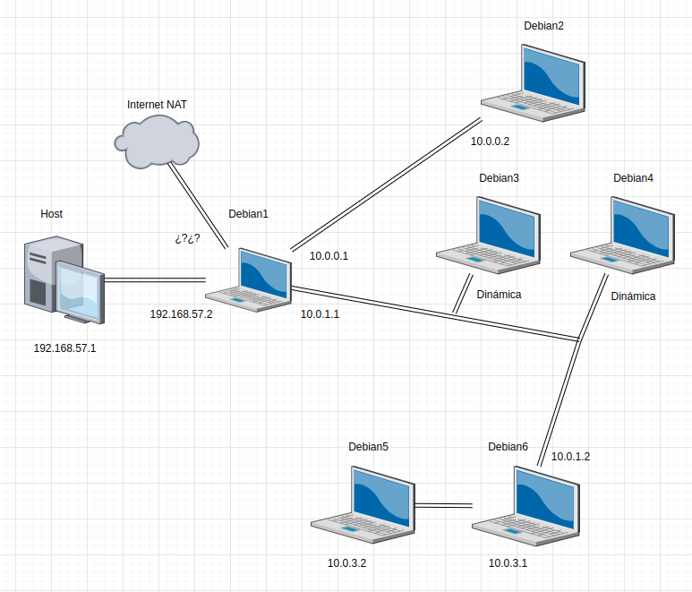

# RED DESEADA



# PASOS SEGUIDOS
## Creación de mvs

### Debian1
Creamos una maquina clonada mediante enlace de la original del curso.

Usamos el siguiente comando para conocer nuestras interfaces de red(previamente se han creado en virtualbox 4 interfaces, la nat, la red interna 1, la red interna2 y la red host-only)

> ip a

En nuestro caso los nombres de los interfaces son los siguientes:

- enp0s3(NAT)
- enp0s8(red interna 1)
- enp0s9(red interna 2)
- enp0s10(red host-only)

### Debian2

Creamos una maquina clonada mediante enlace de la original del curso.Dentro de la configuración de virtualbox abrimos los ajustes y conectamos el adaptador de red 1 la red interna r1

### Debian5 y Debian6

Clonamos la máquina base y generamos las máquinas debian5 y debian6.

En debian5 en la configuración de red el adaptador 1 se conecta a red interna r3.En debian6 en la configuración de red el adaptador 1 se conecta a la red interna r3 y el adapatador 2 a la red interna r2.

### Debian3 y Debian4

Clonamos la máquina base y generamos las máquinas debian3 y debian4.

En ambas abrimos la configuración de virtual box y conectamos el adaptador de red de ambas a la red interna r2.

## Habilitar packet forwarding

### Debian1 y Debian6

Abrir el siguiente archivo de configuración:

> sudo vi /etc/sysctl.conf

Descomentar las siguientes lineas:
```
net.ipv4.ip_forward = 1
net.ipv6.ip_forward = 1
```
Guardar los cambios en el fichero y para aplicar los cambios ejecutar los siguientes comandos

> sudo sysctl -p
> 
> sudo systemctl restart networking

Por motivos desconocidos la instrucción anterior en Debian1 da un bug en el que todos los interfaces funcionan excepto la NAT(enp0s3), en su lugar ejecutar

> sudo shutdown -r now

## Creación de subredes internas

### Debian1

Abrimos el archivo de configuración de interfaz de red:

> sudo vi /etc/network/interfaces

Añadimos las siguientes lineas
```
auto enp0s8
iface enp0s8 inet static
  address 10.0.0.1
  netmask 255.255.255.0

auto enp0s9
iface enp0s9 inet static
  address 10.0.1.1
  netmask 255.255.255.0

auto enp0s10
iface enp0s10 inet static
  address 192.168.57.2
  netmask 255.255.255.0
```

Guardamos el archivo y aplicamos los cambios usando el siguiente comando:

> sudo systemctl restart networking

Por motivos desconocidos la instrucción anterior en esta máquina da un bug en el que todos los interfaces funcionan excepto la NAT(enp0s3), en su lugar ejecutar

> sudo shutdown -r now

Comprobamos que los cambios hayan surtido efecto

> ip a

Probamos la conexión con el host mediante(en windows por motivos del SO anfitrión parece no funcionar):

> ping 192.168.57.1

Probamos la conexión con internet por medio de la NAT mediante:

> ping 8.8.8.8

### Debian2

Abrimos el archivo de configuración de interfaz de red:

> sudo vi /etc/network/interfaces

Comentamos las 3 lineas en las que se define enp0s3 y escribimos las siguientes lineas
```
auto enp0s3
iface enp0s3 inet static
  address 10.0.0.2
  netmask 255.255.255.0
  gateway 10.0.0.1
  broadcast 10.0.0.255
```
Guardamos el archivo y aplicamos los cambios usando el siguiente comando:

> sudo systemctl restart networking

Comprobamos que los cambios hayan surtido efecto

> ip a
> 
> ping 10.0.0.1

Si la máquina nos responde, significa que hemos configurado toda la subred correctamente(debemos hacer la prueba equivalente desde DEBIAN1 usando el mismo comando sustituyendo el último 1 por un 2).

### Debian5

> sudo vi /etc/network/interfaces

Comentamos las lineas que definen enp0s3 y escribimos lo siguiente:
```
auto enp0s3
iface enp0s3 inet static
  address 10.0.3.2
  netmask 255.255.255.0
  network 10.0.3.0
  gateway 10.0.3.1
```
Guardamos el fichero y ejecutamos el siguiente comando para que los cambios surtan efecto:

> sudo systemctl restart networking.service

Comprobamos que los cambios hayan surtido efecto mediante:

> ip a

### Debian6

> sudo vi /etc/network/interfaces

Comentamos las lineas que definen enp0s3 y escribimos lo siguiente
```
auto enp0s3
iface enp0s3 inet static
  address 10.0.3.1
  netmask 255.255.255.0

auto enp0s8
iface enp0s8 inet static
  address 10.0.1.2
  netmask 255.255.255.0
  network 10.0.1.0
  gateway 10.0.1.1
```
Guardamos el fichero y ejecutamos el siguiente comando para que los cambios surtan efecto:

> sudo systemctl restart networking

Comprobamos que los cambios hayan surtido efecto mediante:

> ip a

Probamos la conexión entre Debian5 y Debian6

> ping 10.0.3.2

Si la máquina nos responde, significa que hemos configurado toda la subred correctamente(debemos hacer la prueba equivalente desde Debian5 usando el mismo comando sustituyendo el último 2 por un 1).

Probamos la conexión entre Debian1 y Debian6

> ping 10.0.1.1

Si la máquina nos responde, significa que hemos configurado toda la subred correctamente(debemos hacer la prueba equivalente desde Debian1 usando el mismo comando sustituyendo el último 1 por un 2).

## Debian3 y Debian4

> sudo vi /etc/network/interfaces

Comentamos las lineas que definen enp0s3 y escribimos lo siguiente:
```
auto enp0s3
iface enp0s3 inet dhcp
```
Guardamos el fichero y apagamos las maquinas hasta que podamos probar los cambios.

> sudo shutdown now

No podemos probar todavía que funciona debido a que todavía no hay un servidor dhcp ejecutandose.

## Routing

Para comprobar las rutas de un equipo usamos:

> ip route
### Debian1

Para poder acceder a la red interna3 desde el resto de la red debemos añadir la ruta

> sudo vi /etc/network/interfaces

Justo debajo de la definición de enp0s9(red interna2) añadimos:

```
up ip route add 10.0.3.0/24 via 10.0.1.2
```

Guardamos el archivo y aplicamos los cambios usando el siguiente comando:

> sudo systemctl restart networking

Por motivos desconocidos la instrucción anterior en esta máquina da un bug en el que todos los interfaces funcionan excepto la NAT(enp0s3), en su lugar ejecutar

> sudo shutdown -r now

Para probar que el routing funciona bien ejecutamos:

> ping 10.0.3.1
> 
> ping 10.0.3.2

Si las máquina nos responden, significa que hemos configurado la ruta correctamente.

## Servidor dhcp

### Debian1

Actualizamos las dependencias y descargamos el servidor dhcp

> sudo apt update
> 
> sudo apt install isc-dhcp-server

Eliminamos la configuración por defecto con:

> sudo rm /etc/dhcp/dhcpd.conf

Creamos la nueva configuración con

> sudo vi /etc/dhcp/dhcpd.conf

En la nueva configuración escribimos:
```
default-lease-time 600;
max-lease-time 7200;
authoritative; 
subnet 10.0.1.0 netmask 255.255.255.0 {
  range 10.0.1.3 10.0.1.100;
  option routers 10.0.1.1;
}
```

Guardamos los cambios y asignamos la interfaz al servidor dhcp mediante el siguiente comando:

> sudo vi /etc/default/isc-dhcp-server

Modificamos la linea en la que aparece INTERFACESv4 por

```
INTERFACESv4="enp0s9"
```

Guardamos los cambios y usamos los siguientes comandos para reiniciar el servicio y comprobar que todo funciona:

> sudo systemctl restart isc-dhcp-server.service
> 
> sudo systemctl status isc-dhcp-server.service

Para probar que todo funciona reiniciamos/encendemos las máquinas de debian3 y debian4 y ejecutamos el siguiente comando en ambas

> ping 10.0.1.1

Si recibimos respuesta es que todo funciona correctamente

## Servidor ssh

### Debian6

Probamos que el servidor ssh que se ejecuta por defecto en debian5 nos permite conectarnos  mediante:

> ssh 10.0.3.2

## Servidor nginx

### Debian1

Dado que necesitamos tener acceso a internet desde la red interna pero aún no hemos configurado el firewall de manera temporal vamos a habilitar la conexión mediante:

> sudo iptables -A OUTPUT -j ACCEPT
> 
> sudo iptables -A INPUT -i enp0s3 -m state --state ESTABLISHED,RELATED -j ACCEPT
> 
> sudo iptables -t nat -A POSTROUTING -o enp0s3 -j SNAT --to 192.168.57.2

Adicionalmente para comprobar que el servidor funciona correctamente:

> sudo iptables -t nat -A PREROUTING -i enp0s10 -p tcp --dport 80 -j DNAT --to 10.0.0.2 


### Debian2

Actualizamos las dependencias y instalamos el servidor web nginx

> sudo apt update
> 
> sudo apt install nginx

Con el servidor instalado modificamos el archivo /var/www/html/index.nginx-debian.html con el contenido que queremos mostrar en nuestro servidor web.

Para aplicar los cambios ejecutamos el siguiente comando:

> sudo systemctl restart nginx

Para probar que todo funciona abrimos un navegador en la máquina host y buscamos esto

> 192.168.57.2:80


### Debian1

Borramos las reglas temporales del firewall reiniciando el equipo:

> sudo shutdown -r now

## Firewall

### Debian1

> sudo apt install iptables-persistent

Ejecutamos los siguientes comandos para configurar el firewall:

- Limpiar tablas anteriores

```
sudo iptables -F
sudo iptables -X
sudo iptables -Z
sudo iptables -t nat -F
```

- Rechazar todo por defecto

```
sudo iptables -P INPUT DROP
sudo iptables -P FORWARD DROP
sudo iptables -A INPUT -i lo -j ACCEPT
```

- Permitir conexiones internas

```
sudo iptables -A FORWARD -i enp0s8 -j ACCEPT
sudo iptables -A FORWARD -i enp0s9 -j ACCEPT
sudo iptables -A INPUT -i enp0s8 -j ACCEPT
sudo iptables -A INPUT -i enp0s9 -j ACCEPT
sudo iptables -A OUTPUT -j ACCEPT
```

- Host-only

```
#sudo iptables -A INPUT -i enp0s10 -m state --state ESTABLISHED,RELATED -j ACCEPT
sudo iptables -A FORWARD -i enp0s10 -m state --state ESTABLISHED,RELATED -j ACCEPT
sudo iptables -t nat -A POSTROUTING -o enp0s10 -j SNAT --to 192.168.57.2
sudo iptables -A FORWARD -i enp0s10 -p tcp --dport 80 -j ACCEPT
sudo iptables -A FORWARD -i enp0s10 -p tcp --dport ssh -j ACCEPT
sudo iptables -t nat -A PREROUTING -i enp0s10 -p tcp --dport 80 -j DNAT --to 10.0.0.2
sudo iptables -t nat -A PREROUTING -i enp0s10 -p tcp --dport ssh -j DNAT --to 10.0.3.2
```

- Internet

```
sudo iptables -A INPUT -i enp0s3 -m state --state ESTABLISHED,RELATED -j ACCEPT
sudo iptables -A FORWARD -i enp0s3 -m state --state ESTABLISHED,RELATED -j ACCEPT
sudo iptables -t nat -A POSTROUTING -o enp0s3 -j SNAT --to 192.168.57.2
```

Ejecutar los siguientes comandos para poder guardar la configuración

> sudo iptables-save > /etc/iptables/rules.v4

Si da un error de permisos hacer:

> sudo iptables-save > /home/as/fir
> 
> su root
> 
> cat /home/as/fir > /etc/iptables/rules.v4